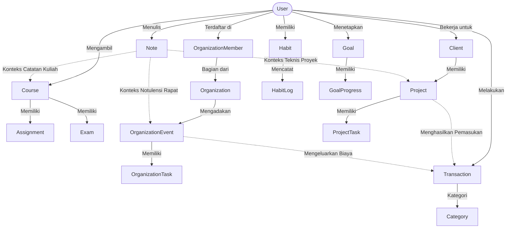

# Domain Model - Kelola Diri

Dokumen ini mendefinisikan model domain bisnis aplikasi **Kelola Diri** beserta batas-batas operasionalnya.

---

## 1. Domain Akademik
- **Tujuan**: Mengelola kehidupan perkuliahan mahasiswa, mulai dari jadwal, penugasan, hingga evaluasi ujian.
- **Entitas Utama**:
  - `Course` (Mata Kuliah)
  - `Assignment` (Tugas Kuliah)
  - `Exam` (Ujian)
- **Relasi dengan Domain Lain**:
  - **Goal**: Target akademis (misal: "IPK > 3.5") dapat dihubungkan ke penyelesaian `Course` tertentu.
  - **Notes**: `Note` dapat dikaitkan dengan `Course` sebagai catatan materi kuliah.

## 2. Domain Organisasi
- **Tujuan**: Mengelola keterlibatan mahasiswa dalam kegiatan organisasi dan kepanitiaan di kampus.
- **Entitas Utama**:
  - `Organization` (Nama Organisasi)
  - `OrganizationMember` (Anggota/Jabatan)
  - `OrganizationEvent` (Program Kerja/Agenda Rapat)
  - `OrganizationTask` (Tugas Kepanitiaan)
- **Relasi dengan Domain Lain**:
  - **Keuangan**: `OrganizationEvent` dapat memicu `Transaction` pengeluaran untuk iuran atau dana operasional kepanitiaan.
  - **Notes**: Rapat `OrganizationEvent` dapat menghasilkan `Note` berupa notulensi rapat.

## 3. Domain Karier & Freelance
- **Tujuan**: Mengelola proyek sampingan, magang, atau pekerjaan freelance mahasiswa.
- **Entitas Utama**:
  - `Client` (Pemberi Kerja)
  - `Project` (Proyek Freelance)
  - `ProjectTask` (Tugas Proyek)
- **Relasi dengan Domain Lain**:
  - **Keuangan**: Penyelesaian `Project` memicu pencatatan `Transaction` pemasukan (income).
  - **Notes**: `Note` dapat digunakan untuk mencatat spesifikasi teknis dari `Project`.

## 4. Domain Keuangan
- **Tujuan**: Memantau arus kas masuk dan keluar mahasiswa untuk mengontrol anggaran secara disiplin.
- **Entitas Utama**:
  - `Transaction` (Transaksi Masuk/Keluar)
  - `Category` (Kategori Transaksi)
- **Relasi dengan Domain Lain**:
  - **Karier**: Menerima pemasukan dari pembayaran `Project`.
  - **Organisasi**: Mencatat pengeluaran yang diakibatkan oleh partisipasi dalam `OrganizationEvent`.

## 5. Domain Habit
- **Tujuan**: Membentuk dan memantau rutinitas harian yang positif untuk produktivitas jangka panjang.
- **Entitas Utama**:
  - `Habit` (Kebiasaan yang ingin dibentuk)
  - `HabitLog` (Catatan check-in harian)
- **Relasi dengan Domain Lain**:
  - **Goal**: Kebiasaan yang konsisten (`Habit`) berkontribusi pada pencapaian target jangka panjang (`Goal`).

## 6. Domain Goal
- **Tujuan**: Menetapkan arah strategis jangka panjang (target hidup) dan melacak pencapaiannya secara bertahap.
- **Entitas Utama**:
  - `Goal` (Target Utama)
  - `GoalProgress` (Langkah/Milestone Pencapaian)
- **Relasi dengan Domain Lain**:
  - **Akademik**: Menghubungkan target kelulusan kuliah ke performa `Course`.
  - **Karier**: Target jumlah proyek/pendapatan dihubungkan ke `Project`.
  - **Habit**: Target kesehatan fisik dihubungkan ke konsistensi `Habit` olahraga.

## 7. Domain Notes
- **Tujuan**: Media pencatatan cepat, rangkuman materi kuliah, riset project, atau notulensi rapat organisasi.
- **Entitas Utama**:
  - `Note` (Catatan berbasis markdown)
- **Relasi dengan Domain Lain**:
  - Menjadi anotasi pendukung untuk `Course` (Akademik), `OrganizationEvent` (Organisasi), dan `Project` (Karier).

---

## Hubungan Antar Domain (Mermaid Diagram)

