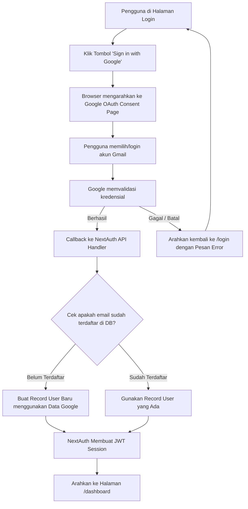
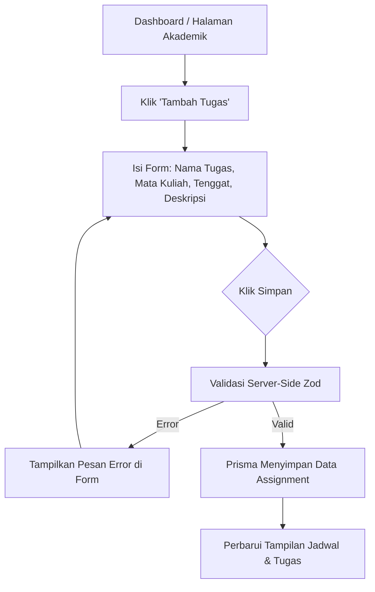
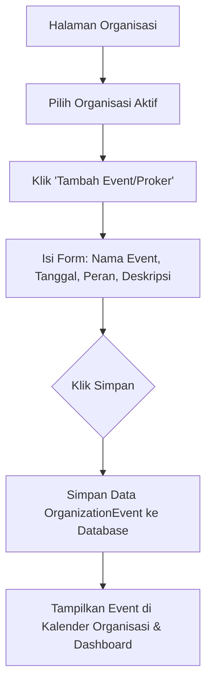
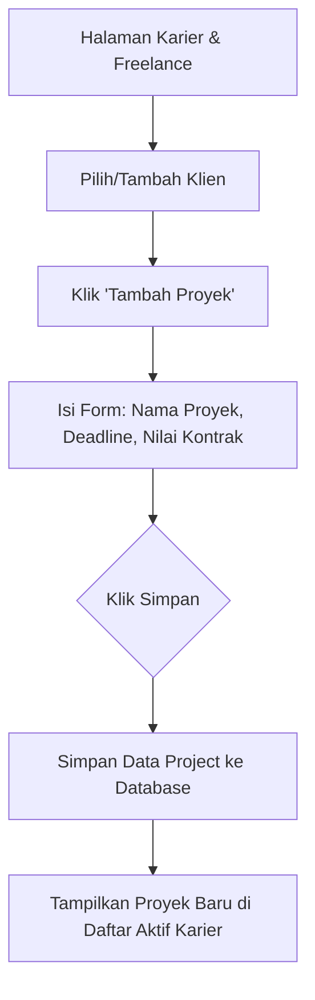
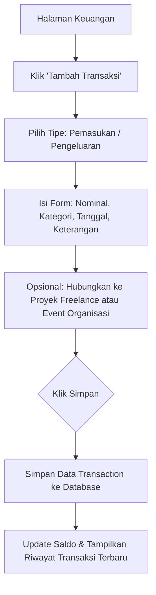
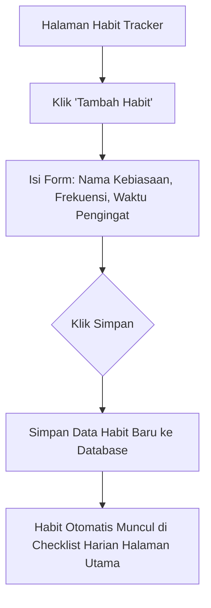
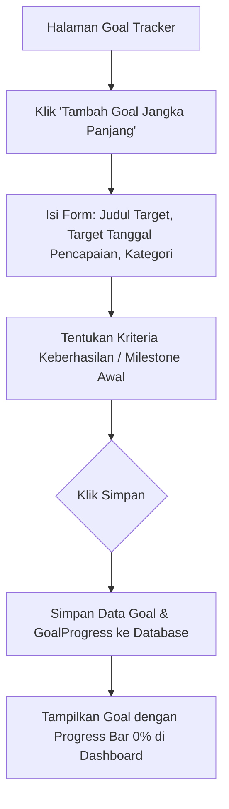
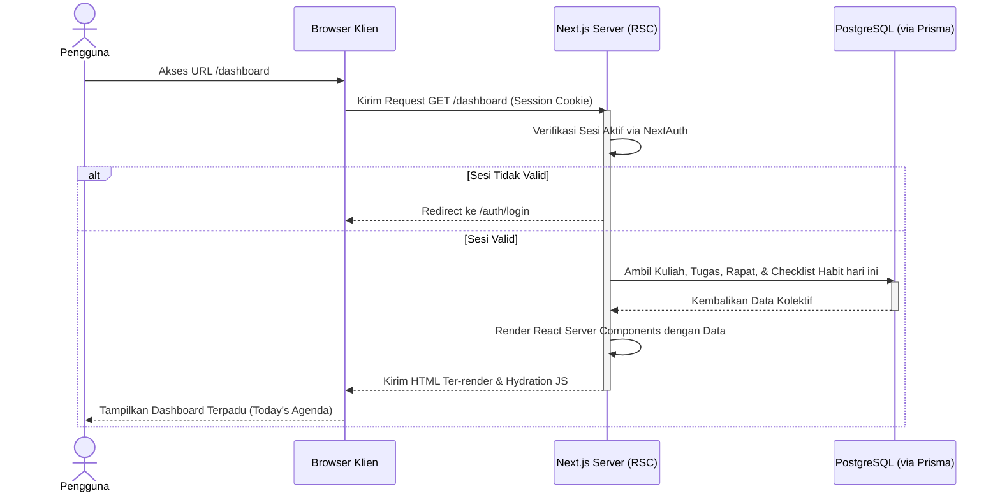

# User Flow - Kelola Diri

Dokumen ini mendeskripsikan alur pengguna (User Flow) untuk 9 fitur utama aplikasi **Kelola Diri** menggunakan diagram alir Mermaid.

---

## 1. Alur Masuk & Pendaftaran Otomatis (Google OAuth Flow)

## 3. Alur Menambah Tugas Kuliah

---

## 4. Alur Menambah Kegiatan Organisasi

---

## 5. Alur Menambah Proyek Freelance

---

## 6. Alur Menambah Transaksi Keuangan

---

## 7. Alur Menambah Habit Baru

---

## 8. Alur Membuat Goal Baru

---

## 9. Alur Melihat Dashboard Utama (Memuat Halaman)
