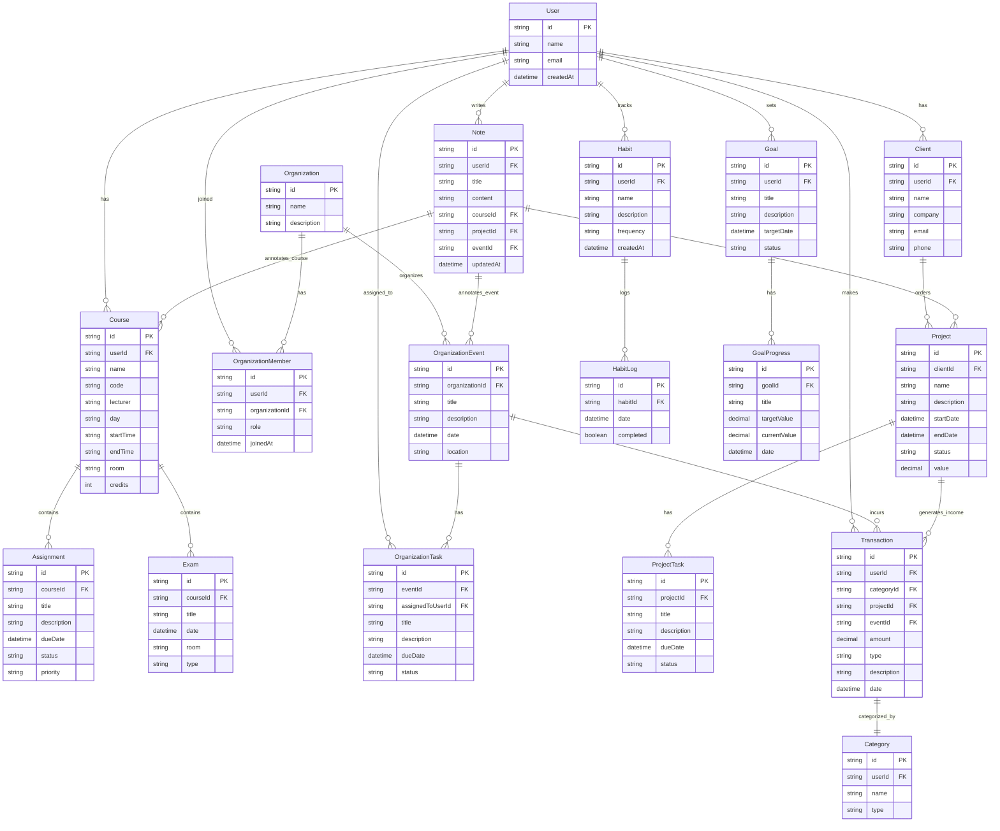

# Entity Relationship Diagram (ERD) - Kelola Diri

Dokumen ini mendefinisikan hubungan antarentitas (Entity Relationship) pada sistem **Kelola Diri** menggunakan diagram ERD Mermaid.

---

## 1. Diagram ERD (Mermaid Diagram)

---

## 2. Aturan Relasi Bisnis

1. **User (Pengguna)**:
   - Menjadi pemilik utama data akademik (`Course`), klien freelance (`Client`), keuangan (`Transaction`), catatan (`Note`), target (`Goal`), dan kebiasaan (`Habit`).
   - Dapat terdaftar di banyak organisasi melalui entitas perantara `OrganizationMember` (Relasi Many-to-Many).
   - Dapat ditunjuk untuk mengerjakan tugas kepanitiaan (`OrganizationTask`) dalam domain organisasi.

2. **Modul Akademik**:
   - Satu `Course` dapat memiliki nol atau banyak `Assignment` dan `Exam`. Penghapusan `Course` akan menghapus seluruh `Assignment` dan `Exam` terkait secara kaskade (*cascade deletion*).

3. **Modul Organisasi**:
   - Entitas `OrganizationMember` menghubungkan `User` ke `Organization` dengan tambahan informasi peran/jabatan (misal: "Staf", "Ketua").
   - Organisasi menyelenggarakan banyak `OrganizationEvent` (Proker). Setiap `OrganizationEvent` dapat memiliki sub-tugas `OrganizationTask` yang didelegasikan ke pengguna tertentu.

4. **Modul Karier & Freelance**:
   - `Client` terhubung ke satu `User`. `Client` dapat memberikan banyak `Project`.
   - Setiap `Project` dibagi menjadi beberapa `ProjectTask`.

5. **Modul Keuangan**:
   - Setiap `Transaction` dikaitkan dengan satu `Category` milik pengguna.
   - Transaksi dapat bersifat independen, atau ditautkan opsional ke `Project` (merekam pemasukan proyek) atau `OrganizationEvent` (merekam iuran/pengeluaran proker).

6. **Modul Habit & Goal**:
   - `HabitLog` merekam sejarah check-in harian untuk kebiasaan (`Habit`).
   - `GoalProgress` merekam milestone kuantitatif (misalnya: menaikkan target dari 0% ke 100%) untuk memantau pencapaian `Goal` utama.