# Sitemap Aplikasi - Kelola Diri

Dokumen ini mendefinisikan peta situs (Sitemap) dan struktur navigasi rute halaman pada aplikasi **Kelola Diri** (Next.js App Router).

---

## 1. Diagram Sitemap (Mermaid Diagram)

```mermaid
graph TD
    Root([Aplikasi Kelola Diri])
    
    %% Auth
    Root --> Auth[Autentikasi]
    Auth --> Login["/login"]
    
    %% Dashboard
    Root --> Dashboard["/dashboard - Beranda Utama"]
    
    %% Akademik
    Root --> Akademik["/academic - Modul Akademik"]
    Akademik --> MK["/academic/courses - Mata Kuliah"]
    Akademik --> Tugas["/academic/assignments - Tugas Kuliah"]
    Akademik --> Ujian["/academic/exams - Jadwal Ujian"]
    
    %% Organisasi
    Root --> Organisasi["/organizations - Modul Organisasi"]
    Organisasi --> OrgList["/organizations - Daftar Organisasi"]
    Organisasi --> OrgDetail["/organizations/:id - Detail Organisasi"]
    OrgDetail --> Proker["/organizations/:id/programs - Program Kerja"]
    OrgDetail --> Event["/organizations/:id/events - Jadwal Rapat/Event"]
    
    %% Karier
    Root --> Karier["/career - Modul Karier/Freelance"]
    Karier --> Klien["/career/clients - Manajemen Klien"]
    Karier --> Proyek["/career/projects - Manajemen Proyek"]
    
    %% Keuangan
    Root --> Keuangan["/finance - Modul Keuangan"]
    Keuangan --> Transaksi["/finance/transactions - Riwayat Transaksi"]
    
    %% Habit
    Root --> Habit["/habits - Habit Tracker"]
    
    %% Goal
    Root --> Goal["/goals - Goal Tracker"]
    
    %% Notes
    Root --> Notes["/notes - Markdown Notes"]
    
    %% Settings
    Root --> Settings["/settings - Pengaturan Akun"]
    
    style Root fill:#f9f,stroke:#333,stroke-width:2px
    style Dashboard fill:#bbf,stroke:#333,stroke-width:1px
```

---

## 2. Deskripsi Halaman & Hak Akses

1. **Halaman Publik (Public Routes)**:
   - `/login`: Halaman masuk pengguna menggunakan Google OAuth ("Sign in with Google").

2. **Halaman Terproteksi (Private/Protected Routes - Membutuhkan Sesi NextAuth)**:
   - `/dashboard`: Berisi rangkuman agenda hari ini (Today's Agenda), sisa anggaran keuangan, grafik konsistensi habit, serta checklist tugas kuliah terdekat.
   - `/academic`: Halaman utama pengelolaan akademik dengan sub-tab untuk jadwal mata kuliah, dafar tugas aktif, dan list jadwal ujian mendatang.
   - `/organizations`: Menampilkan daftar organisasi yang diikuti. Pengguna bisa masuk ke detail organisasi `/organizations/:id` untuk mengelola event kepanitiaan dan program kerja terkait.
   - `/career`: Pusat kendali proyek freelance. Memisahkan data profil klien (`/career/clients`) dan progress proyek aktif (`/career/projects`).
   - `/finance`: Dashboard pencatatan transaksi masuk dan keluar harian. Menyediakan grafik analisis aliran kas bulanan.
   - `/habits`: Papan interaktif pelacakan habit dengan checklist harian dan kalender streak kontribusi habit.
   - `/goals`: Pelacak pencapaian jangka panjang dengan progress bar pencapaian langkah/milestone.
   - `/notes`: Editor teks berbasis Markdown terintegrasi untuk mencatat ringkasan kuliah, notulen rapat, atau draf ide.
   - `/settings`: Pengaturan profil pengguna, ubah password, dan kustomisasi kategori transaksi keuangan default.