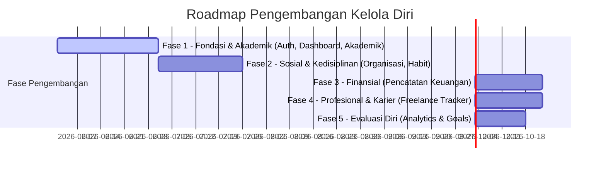

# Roadmap Pengembangan - Kelola Diri

Dokumen ini memetakan rencana jalan pengembangan aplikasi **Kelola Diri** dari Fase 1 hingga Fase 5, lengkap dengan Sasaran (Goal), Hasil yang Diberikan (Deliverables), dan Kriteria Keberhasilan (Success Criteria) untuk masing-masing fase.

---

## Ringkasan Roadmap

---

## Rincian Fase

### Fase 1: Fondasi Keamanan & Manajemen Akademik (MVP)
- **Goal**: Membangun sistem autentikasi pengguna yang aman, dasbor ringkasan harian, dan fitur manajemen akademik (jadwal kuliah, pelacak tugas, jadwal ujian) sebagai nilai guna utama aplikasi.
- **Deliverables**:
  - Masuk log (login) sekali klik terintegrasi **Google OAuth 2.0 (Gmail)** berbasis **NextAuth**.
  - Halaman **Dashboard Utama** yang menampilkan agenda perkuliahan hari ini, tugas yang akan segera tenggat, dan catatan cepat.
  - Modul Akademik: CRUD jadwal mata kuliah, pelacakan status tugas (Belum Mulai, Sedang Dikerjakan, Selesai), dan daftar jadwal ujian.
  - Editor **Catatan Markdown** sederhana untuk merangkum modul kuliah.
- **Success Criteria**:
  - Pengguna dapat masuk log menggunakan Gmail dengan lancar, rute halaman privat terproteksi dengan baik, dan data profil pengguna tersimpan otomatis saat pendaftaran pertama kali.
  - Pengguna dapat menginput jadwal kuliah semester baru dan melihat tugas kuliah terdekat diurutkan berdasarkan prioritas tenggat waktu secara real-time di dashboard.

---

### Fase 2: Manajemen Organisasi & Pembentukan Habit (MVP)
- **Goal**: Mendukung mahasiswa dalam berjejaring di kampus melalui pengelolaan agenda organisasi/kepanitiaan serta melatih produktivitas diri lewat pembentukan kebiasaan harian (habits).
- **Deliverables**:
  - Modul Organisasi: CRUD profil organisasi, pencatatan jabatan, penentuan program kerja (proker), serta pelacakan daftar penugasan kepanitiaan personal.
  - Modul Habit Tracker: Pembuatan target kebiasaan harian dengan tombol centang cepat (checklist).
  - Statistik Habit: Kalender grafik heatmap (streak) untuk memvisualisasikan konsistensi kebiasaan yang dicentang.
- **Success Criteria**:
  - Rapat organisasi yang diinput muncul secara otomatis di kalender dashboard pengguna berdampingan dengan jadwal kuliah.
  - Heatmap habit ter-render secara visual dengan warna kontribusi yang sesuai dengan tingkat konsistensi check-in harian pengguna.

---

### Fase 3: Pengendalian Keuangan Pribadi (Future Scope)
- **Goal**: Membantu mahasiswa (khususnya mahasiswa kost) mengontrol arus kas pribadi agar mandiri secara finansial.
- **Deliverables**:
  - Pencatatan transaksi masuk dan keluar harian terklasifikasi menurut kategori pengeluaran (makanan, transportasi, hobi, kebutuhan kuliah).
  - Pengaturan limit anggaran (budgeting) bulanan per kategori.
  - Integrasi iuran organisasi dari modul organisasi ke pencatatan transaksi pengeluaran keuangan secara otomatis.
- **Success Criteria**:
  - Sistem menampilkan grafik ringkasan alokasi pengeluaran bulanan.
  - Muncul indikator peringatan (warning indicator) di halaman keuangan ketika total transaksi pengeluaran kategori mendekati batas limit anggaran bulanan yang ditentukan (>80%).

---

### Fase 4: Manajemen Karier & Proyek Freelance (Future Scope)
- **Goal**: Mendukung mahasiswa yang memiliki pekerjaan sampingan atau proyek freelance agar dapat menyelesaikan pekerjaan tepat waktu tanpa mengabaikan kuliah.
- **Deliverables**:
  - Direktori data kontak klien dan status proyek freelance aktif.
  - Pembagian proyek menjadi milestone/backlog tugas pengerjaan (ProjectTask).
  - Pelacak keuangan proyek: mencatat tanggal penagihan invoice (DP & Pelunasan) yang langsung terhubung ke modul keuangan sebagai pemasukan.
- **Success Criteria**:
  - Jadwal deadline proyek freelance tampil di kalender dashboard agar pengguna bisa mengantisipasi bentrok dengan deadline tugas kuliah.
  - Status transaksi pendapatan proyek terperbarui otomatis di modul keuangan setelah invoice proyek ditandai sebagai "Lunas".

---

### Fase 5: Analisis Progres & Refleksi Target Hidup (Analytics)
- **Goal**: Menyajikan laporan visual yang komprehensif (Personal Analytics) serta pelacakan target hidup jangka panjang (Goals) untuk membantu mahasiswa berevaluasi diri.
- **Deliverables**:
  - Modul Goal Tracker: Menetapkan tujuan hidup (misal: "IPK Kelulusan > 3.50") dan mengelola milestone pencapaian kuantitatif.
  - Dashboard Analisis: Grafik korelasi yang memperlihatkan dampak kebiasaan belajar terhadap performa akademik, serta laporan ringkas kesehatan finansial vs tabungan proyek freelance.
- **Success Criteria**:
  - Pengguna dapat memantau persentase pencapaian goal jangka panjang melalui progress bar interaktif di dashboard.
  - Laporan refleksi mingguan ter-render dengan akurat berdasarkan agregasi data log habit, IPK akademik, dan rasio keuangan tabungan.